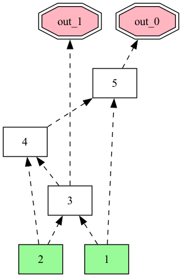

# aigrandom


Random And-Inverter Graph (AIG) generator in the [AIGER format](http://fmv.jku.at/aiger).
Built on top of the [AIGER library](https://github.com/arminbiere/aiger) by Prof. Armin Biere. This is a C version, for Python integration, [aigverse](https://github.com/marcelwa/aigverse) also provides the functionality which is based on [mockturtle](https://github.com/lsils/mockturtle).

## Build

```sh
make                # produces the 'aigrandom' binary
make libaigrandom.a # produces a static library
make clean          # remove all build artifacts
```

Requires a C compiler (`gcc` or `clang`). The build uses `CC ?= gcc` and
`CFLAGS ?= -O3 -Wall` which can be overridden on the command line:

```sh
make CC=clang CFLAGS="-O2 -g"
```

## CLI Usage

```
aigrandom [-h][-v][-a][-c][-s][-d][-n <count>][<output>]
```

Generate random AIGs and write them in AIGER format.

### Flags

| Flag | Description |
|------|-------------|
| `-h` | Print usage summary and exit |
| `-v` | Verbose output on stderr (MILOA statistics + comments in file) |
| `-a` | Force ASCII (`.aag`) output format |
| `-c` | Combinational only — no latches |
| `-s` | Attach symbolic names to inputs, latches, and outputs |
| `-d` | Also write a DOT graph visualization file (`.dot`) alongside the AIG output |
| `-n <count>` | Generate `<count>` AIG files (default 1) |

### Size bounds

Each component count is picked randomly within its min/max range per
invocation. Use these flags to control the complexity distribution.

| Option | Default | Meaning |
|--------|---------|---------|
| `--min-inputs <n>` | 1 | Minimum number of primary inputs |
| `--max-inputs <n>` | 20 | Maximum number of primary inputs |
| `--min-latches <n>` | 0 | Minimum number of latches |
| `--max-latches <n>` | 10 | Maximum number of latches |
| `--min-ands <n>` | 0 | Minimum number of AND gates |
| `--max-ands <n>` | 100 | Maximum number of AND gates |
| `--min-outputs <n>` | 1 | Minimum number of outputs |
| `--max-outputs <n>` | 10 | Maximum number of outputs |
| `--seed <n>` | time-based | Random seed for reproducibility |

### Output file

If `<output>` is given, the AIG is written to that file. The format is
determined by the file extension: `.aag` for ASCII, `.aig` for binary.
When `-n` is greater than 1, use `%d` in the filename as an index
placeholder. If no output file is given, the result is written to stdout
(ASCII mode if a terminal, binary otherwise).

When `-d` is used, a `.dot` file is written alongside each AIG file (the
`.aig`/`.aag` extension is replaced with `.dot`). The DOT file can be
rendered with Graphviz: `dot -Tpng graph.dot -o graph.png`.

### DOT visualization legend

| Component | Shape | Color | Description |
|-----------|-------|-------|-------------|
| Input | Box | Pale green (filled) | Primary input, placed at the bottom (`rank = source`) |
| AND gate | Box | Default (white) | AND gate, shown as the default `box` node in the middle layers |
| Latch | Box | Magenta border | Latch (sequential element), placement determined by the layout engine based on connectivity |
| Output | Double octagon | Light pink (filled) | Primary output, placed at the top (`rank = sink`) |

Edges:
- **Solid arrow** — non-inverted connection (positive literal)
- **Dashed arrow** — inverted connection (negated literal, the sign bit is set)

Nodes are labeled with their symbolic names when `-s` is used (e.g. `input_0`,
`output_3`), otherwise with variable indices (e.g. `1`, `15`). Inputs are
guaranteed to be referenced by at least one AND gate, latch, or output —
unused inputs are automatically removed before the DOT file is written.

## Examples

### Minimal combinational circuit to stdout

```sh
./aigrandom -a -c --seed 42
```

### Deterministic sequential AIG to a file

```sh
./aigrandom -v --seed 123 circuit.aig
```

### Combinational with symbols

```sh
./aigrandom -s -c --seed 7 circuit.aag
```

### Large batch of combinational AIGs

```sh
./aigrandom -c -n 100 --max-inputs 50 --max-ands 500 --seed 0 batch_%d.aig
```

This produces `batch_0.aig` through `batch_99.aig`.

### Very small circuits for fuzzing

```sh
./aigrandom -c \
  --min-inputs 1 --max-inputs 3 \
  --min-ands 0 --max-ands 5 \
  --min-outputs 1 --max-outputs 2 \
  -n 10 --seed 1 tiny_%d.aig
```

### Reproducibility check (same seed = same file)

```sh
./aigrandom -c --seed 42 a.aig
./aigrandom -c --seed 42 b.aig
diff a.aig b.aig   # files are identical
```

### Generate AIG with DOT visualization

```sh
./aigrandom -c\                   
  --min-inputs 3 --max-inputs 5 \
  --min-ands 0 --max-ands 10 \               
  --min-outputs 1 --max-outputs 2 \
  --seed 42 -d tiny_0.aig
dot -Tpng tiny_0.dot -o tiny_0.png
```

The random generated combinational logic shows as 
<p align="center">
    
</p>

## Output format

The tool produces valid AIGER files (`.aig` binary or `.aag` ASCII) that can
be read by any AIGER-compatible tool such as `aiginfo`, `aigtoaig`, `aigsim`,
or model checkers from the Hardware Model Checking Competition.

Every generated AIG passes `aiger_check()` internally before being written,
guaranteeing syntactic and semantic correctness:
- All referenced literals are defined (inputs, latches, or AND gates)
- The AND graph is acyclic
- The header M I L O A counts are consistent

## Code format
Since file `aiger.c`, `aiger.h` is inherited from [AIGER library](https://github.com/arminbiere/aiger), the code style remains no change. For other source files, they should be formatted using `clang-format`. We are generally using Google style.
